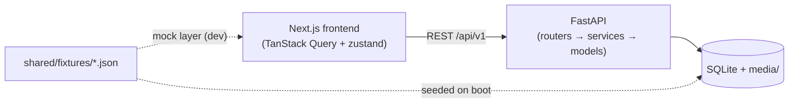
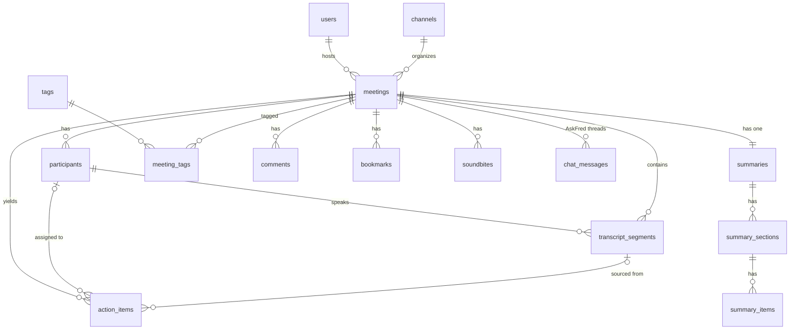

# Fireflies.ai Clone — Meeting Notes & Transcription Platform

> A functional clone of the Fireflies.ai meeting-assistant web app: browse a
> library of meetings, view interactive transcripts synced to a media player,
> read AI-generated summaries & action items, search across transcripts, and
> experience the clean, productivity-focused Fireflies workspace.

**SDE Fullstack Assignment — Scaler AI Labs**

| | |
|---|---|
| 🌐 **Live demo** | _\[deployed URL — see Hosting below\]_ |
| 📦 **Repo** | `frontend/` + `backend/` + `shared/` + `docs/` |
| ⏱ **Build time** | ~24 hours |

---

## Tech stack

| Layer | Technology | Why |
|---|---|---|
| **Frontend** | Next.js 16 (App Router) · TypeScript · Tailwind CSS v4 | Assignment-mandated; App Router + typed client, Tailwind tokens for the design system |
| **UI** | shadcn/ui (Radix) · lucide-react · sonner | Accessible primitives restyled to the Fireflies design tokens |
| **Data** | TanStack Query v5 · zustand | Server cache/invalidation; high-frequency player state |
| **Backend** | FastAPI · SQLAlchemy 2.0 · Pydantic v2 · uvicorn | Clean REST layer, typed ORM + schemas |
| **Database** | SQLite (WAL mode) | Assignment-mandated; zero-config persistence |
| **AI** | Rule-based engines (stdlib) + optional LLM branch | Deterministic + offline; LLM via `LLM_API_KEY` (assignment: LLM is optional) |
| **Fonts** | DM Sans (headings) · Inter (body) | The actual Notepad fonts used by Fireflies |

---

## Architecture overview

```
┌──────────────────────────┐        ┌─────────────────────────────────┐
│  Next.js frontend (SPA)  │  REST  │  FastAPI backend                │
│  Vercel                  │ ─────► │  Render                         │
│  - App Router pages      │  JSON  │  - routers/  (HTTP layer)       │
│  - TanStack Query cache  │        │  - services/ (AI engines)       │
│  - zustand player store  │        │  - models/   (SQLAlchemy ORM)   │
└──────────────────────────┘        │  - seed/     (fixtures loader)  │
                                    └──────────┬──────────────────────┘
                                               │
                                    ┌──────────▼──────────────────────┐
                                    │  SQLite (WAL) + /media (WAV)    │
                                    └─────────────────────────────────┘
```



**Frontend** — App Router pages under `frontend/src/app/`. Server-state via
TanStack Query; player/transcript sync via a zustand store. The `ApiClient`
interface (`frontend/src/lib/types.ts`) is the frozen contract — two
implementations (mock + HTTP) swapped by `NEXT_PUBLIC_USE_MOCKS`.

**Backend** — layered FastAPI: `routers/` (HTTP) → `services/` (business
logic/engines) → `models/` (SQLAlchemy). Auto-seeds on boot from
`shared/fixtures/` so the demo is always populated.

**Shared data** — `shared/fixtures/` is the **single source of truth** for demo
content: the same JSON feeds the frontend mock layer (dev) and the backend
seeder (prod). `shared/samples/` has real-format transcripts for testing upload.

**Key algorithms** (see `docs/03-LOW-LEVEL-DESIGN.md` §5):
- **Transcript ↔ player sync** — binary search over sorted segments; active-line highlight + auto-scroll; click any line/timestamp seeks the player
- **Summary engine** — keyword frequency → sentence ranking → overview / notes / topic chapters / metrics; action-item extraction with provenance
- **AskFred** — intent regex + keyword retrieval + timestamped citations
- **Smart-search filters** — regex classification (questions/tasks/dates/metrics/pricing/sentiment/fillers)

---

## Database schema

16 tables + FTS-ready indexes. Full DDL in `docs/03-LOW-LEVEL-DESIGN.md` §1.3.



| Table | Purpose | Key relationships |
|---|---|---|
| `users` | Mocked default user | 1 → N `meetings` (hosts) |
| `channels` | Notebook channels ("My Meetings") | 1 → N `meetings` |
| `meetings` | The meeting record (title, date, status, media) | FK → `users`, `channels` |
| `participants` | Speakers per meeting (avatar color, talk-time) | FK → `meetings` |
| `transcript_segments` | One row per utterance (`start_ms`/`end_ms` INTEGER ms) | FK → `meetings`, `participants` (speaker) |
| `summaries` | One AI summary per meeting (template, generator) | FK → `meetings` (UNIQUE) |
| `summary_sections` | Overview / Notes / Topics / Metrics blocks | FK → `summaries` |
| `summary_items` | Bullet lines with optional `(MM:SS)` anchors | FK → `summary_sections`, `transcript_segments` (source) |
| `action_items` | Tasks w/ assignee, status, due date, provenance | FK → `meetings`, `participants`, `transcript_segments` |
| `tags` + `meeting_tags` | N↔N tags for filtering | junction table |
| `comments` | Timestamped comments anchored to segments | FK → `meetings`, `transcript_segments`, `users` |
| `bookmarks` | Saved moments | FK → `meetings`, `transcript_segments` |
| `soundbites` | Clip ranges | FK → `meetings`, `users` |
| `chat_messages` | AskFred thread (`meeting_id` NULL = global) | FK → `meetings` (nullable) |
| `settings` | Single-row app settings | PK = 1 (CHECK constraint) |

**Design choices**
- `*_ms INTEGER` for media times (exact/sortable) vs ISO strings for calendar times
- Cascades: deleting a meeting removes its transcript/summary/action-items/comments/bookmarks/soundbites/chat; tags survive (shared via junction)
- `source_segment_id` on action items + summary items = **provenance** ("jump to the moment this came from")

---

## API overview (REST, `/api/v1`)

Full reference: `docs/03-LOW-LEVEL-DESIGN.md` §2. Interactive docs at `/docs`
when the backend runs.

| Area | Endpoints |
|---|---|
| **Meetings** | `GET /meetings` (filters: q, participant, tag, status, date range, sort, pagination) · `POST /meetings` (JSON / multipart transcript) · `GET/PATCH/DELETE /meetings/{id}` |
| **Transcript** | `GET /meetings/{id}/transcript` · `PATCH /transcript-segments/{id}` (autosave edit) |
| **Summary** | `GET /meetings/{id}/summary` · `POST /meetings/{id}/regenerate` · `PATCH /summary-items/{id}` |
| **Tasks** | `GET /tasks` (cross-meeting) · `POST /meetings/{id}/action-items` · `PATCH/DELETE /action-items/{id}` |
| **AskFred** | `POST /meetings/{id}/chat` · `POST /chat` (global) · `GET /chat` · `DELETE /chat` (New Chat) |
| **Search** | `GET /search?q=` (grouped meetings + transcript hits with `<mark>` snippets) |
| **Engagement** | `GET/POST /meetings/{id}/comments|bookmarks|soundbites` · `DELETE /comments|bookmarks|soundbites/{id}` |
| **Export** | `GET /meetings/{id}/export?format=txt|md|srt|vtt|json` |
| **Meta** | `GET /me` · `GET/PATCH /settings` · `GET /dashboard` · `GET /health` · `POST /admin/reseed` |

---

## Setup — run locally

```bash
# 1) Backend (port 8000)
cd backend
pip install -r requirements.txt
uvicorn app.main:app --reload --port 8000
# → auto-creates data/fireflies.db and seeds 8 demo meetings from shared/fixtures/
# → API docs at http://localhost:8000/docs

# 2) Frontend (port 3000) — new terminal
cd frontend
npm install
npm run dev
# → http://localhost:3000
```

**Environment variables**

| File | Var | Local default |
|---|---|---|
| `frontend/.env` | `NEXT_PUBLIC_API_URL` | `http://localhost:8000/api/v1` |
| | `NEXT_PUBLIC_USE_MOCKS` | `false` (set `true` to run without the backend) |
| `backend/.env` | `CORS_ORIGINS` | `http://localhost:3000` |
| | `SEED_ON_START` | `true` |
| | `LLM_API_KEY` (optional) | _empty_ — rule-based engines run when absent |

**Sample data**: `shared/fixtures/` (8 rich meetings) seeds automatically.
Real-format transcripts for testing upload: `shared/samples/`.

---

## Hosting (Vercel + Render)

**Backend — Render (Web Service)**
1. render.com → **New → Web Service** → connect this repo
2. **Root directory**: `backend`
3. **Build command**: `pip install -r requirements.txt`
4. **Start command**: `uvicorn app.main:app --host 0.0.0.0 --port $PORT`
5. **Env**: `CORS_ORIGINS=https://<your-vercel-app>.vercel.app` · `SEED_ON_START=true`
6. Deploy → note the URL `https://<app>.onrender.com`

**Frontend — Vercel**
1. vercel.com → **New Project** → import this repo
2. **Root directory**: `frontend` (framework preset: Next.js, auto-detected)
3. **Env**: `NEXT_PUBLIC_API_URL=https://<app>.onrender.com/api/v1` · `NEXT_PUBLIC_USE_MOCKS=false`
4. Deploy

> **Note on Render free tier**: the disk is ephemeral — SQLite resets on
> redeploy. `SEED_ON_START=true` auto-reseeds demo data on boot, so the demo
> self-heals. For durable data, mount a persistent disk or use a managed DB.

---

## Assumptions & limitations

| # | Assumption | Rationale |
|---|---|---|
| 1 | **Auth is mocked** (one default user: Vishesh Gupta) | Assignment: "assume a default logged-in user" |
| 2 | **Real speech-to-text is out of scope** | Assignment lists it under "Mocked / Placeholder Sections"; we accept uploaded transcript files (`.txt`/`.vtt`/`.srt`/`.json`) instead |
| 3 | **LLM is optional** | Assignment: "optionally call an LLM". Rule-based engines (keyword scoring, regex classification, intent retrieval) run offline/deterministically; `LLM_API_KEY` enables the LLM branch |
| 4 | **Audio is synthesized** (soft tones per speaker turn) | Real recordings aren't shipped; WAVs are generated at seed time so the player/seek/transcript-sync behave for real |
| 5 | **Integrations / live bot / team sharing are placeholders** | Assignment lists them as mocked ("Coming Soon" toasts) |
| 6 | **SQLite** (not Postgres) | Assignment mandates SQLite; WAL mode + indexing handles the demo scale |
| 7 | **Single-user workspace** | Multi-tenancy/user management out of scope |
| 8 | **Rule-based summary quality** | Summaries are extractive (top-ranked sentences + keyword chapters), not abstractive — LLM upgrades output quality when a key is provided |

---

## Testing

```bash
# Backend — 21-check end-to-end smoke test
cd backend && python tests/smoke.py

# Backend — transcript parser tests
cd backend && python tests/test_parse.py

# Frontend — build + typecheck
cd frontend && npm run build
```

The smoke test covers: seed → meetings list/filters → transcript/stats → summary → tasks → create-meeting (with auto-summary) → search → AskFred w/ citations → exports → comments/bookmarks/soundbites CRUD → chat history.

---

## Project structure

```
├── frontend/                 # Next.js 16 (TS, Tailwind v4, shadcn/ui)
│   ├── src/app/              # routes: /login / /meetings /meetings/[id] /uploads /tasks /askfred /settings /integrations
│   ├── src/components/       # layout · meetings · notepad · shared · ui
│   ├── src/hooks/ · src/store/ · src/lib/  # sync hooks, zustand stores, api client
│   └── scripts/              # fixture sync, smoke test
├── backend/                  # FastAPI + SQLAlchemy
│   ├── app/models/           # 16 ORM models
│   ├── app/routers/          # meta · meetings · summaries · action-items · search · engagement
│   ├── app/services/         # summary engine · chat engine · search · export · media synth
│   ├── app/seed/             # fixtures loader + WAV generation
│   └── tests/                # smoke + parser tests
├── shared/
│   ├── fixtures/             # 8 demo meetings (single source of truth)
│   └── samples/              # real-format transcripts for upload testing
└── docs/                     # UI/UX research · HLD · LLD (schema+API) · tech stack · roadmap
```

## Documentation

| Doc | Contents |
|---|---|
| `docs/00-PROJECT-OVERVIEW.md` | Scope, decisions, feature matrix |
| `docs/01-UIUX-RESEARCH.md` | Fireflies design study (tokens, layouts, specs) |
| `docs/02-HIGH-LEVEL-DESIGN.md` | Architecture, data flows, deployment |
| `docs/03-LOW-LEVEL-DESIGN.md` | DB schema (DDL + ERD), full API spec, algorithms |
| `docs/04-TECH-STACK-AND-LIBRARIES.md` | Every dependency, justified |
| `docs/05-ROADMAP.md` | Build log across 8 phases |
