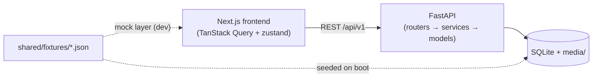
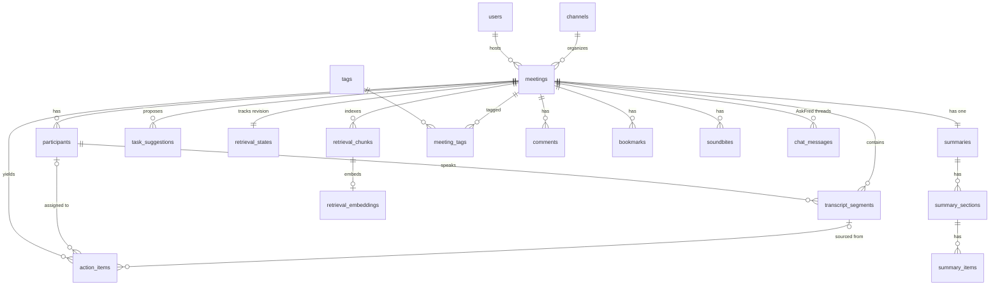
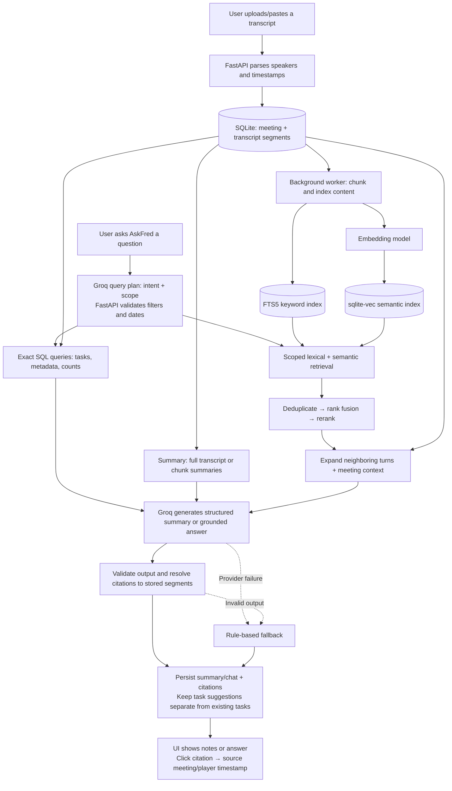

# Fireflies.ai Clone — Meeting Notes & Transcription Platform

> A functional clone of the Fireflies.ai meeting-assistant web app: browse a
> library of meetings, view interactive transcripts synced to a media player,
> read AI-generated summaries & action items, search across transcripts, and
> experience the clean, productivity-focused Fireflies workspace.

**SDE Fullstack Assignment — Scaler AI Labs**

| | |
|---|---|
| 🌐 **Live demo** | _\[https://fireflies.vishesh.site]_ |
| 📦 **Repo** | `frontend/` + `backend/` + `shared/` + `docs/` |
| ⏱ **Build time** | ~24 hours |

---

## Tech stack

| Layer | Technology | Why |
|---|---|---|
| **Frontend** | Next.js 16 (App Router) · TypeScript · Tailwind CSS v4 | Assignment-mandated; App Router + typed client, Tailwind tokens for the design system |
| **UI** | shadcn/ui (Radix) · lucide-react · sonner | Accessible primitives restyled to the Fireflies design tokens |
| **Data** | TanStack Query v5 · zustand | Server cache/invalidation; high-frequency player state |
| **Backend** | FastAPI · SQLAlchemy 2.0 · Pydantic v2 · uvicorn | Clean REST layer, typed ORM + schemas |
| **Database** | SQLite (WAL mode) | Assignment-mandated; zero-config persistence |
| **AI** | Rule engines + opt-in Groq; SQL/FTS5/vector retrieval | Deterministic fallback; backend-only credentials and usage guards |
| **Fonts** | DM Sans (headings) · Inter (body) | The actual Notepad fonts used by Fireflies |

---

## Architecture overview

```
┌──────────────────────────┐        ┌─────────────────────────────────┐
│  Next.js frontend (SPA)  │  REST  │  FastAPI backend                │
│  Vercel                  │ ─────► │  Azure VM + nginx + systemd      │
│  - App Router pages      │  JSON  │  - routers/  (HTTP layer)       │
│  - TanStack Query cache  │        │  - services/ (AI engines)       │
│  - zustand player store  │        │  - models/   (SQLAlchemy ORM)   │
└──────────────────────────┘        │  - seed/     (fixtures loader)  │
                                    └──────────┬──────────────────────┘
                                               │
                                    ┌──────────▼──────────────────────┐
                                    │  SQLite (WAL) + /media (WAV)    │
                                    └─────────────────────────────────┘
```



**Frontend** — App Router pages under `frontend/src/app/`. Server-state via
TanStack Query; player/transcript sync via a zustand store. The `ApiClient`
interface (`frontend/src/lib/types.ts`) is the frozen contract — two
implementations (mock + HTTP) swapped by `NEXT_PUBLIC_USE_MOCKS`.

**Backend** — layered FastAPI: `routers/` (HTTP) → `services/` (business
logic/engines) → `models/` (SQLAlchemy). Seeds a new workspace from
`shared/fixtures/`; ordinary restarts preserve existing records.

**Shared data** — `shared/fixtures/` is the **single source of truth** for demo
content: the same JSON feeds the frontend mock layer (dev) and the backend
seeder (prod). `shared/samples/` has real-format transcripts for testing upload.

**Key algorithms** (see `docs/03-LOW-LEVEL-DESIGN.md` §5):
- **Transcript ↔ player sync** — binary search over sorted segments; active-line highlight + auto-scroll; click any line/timestamp seeks the player
- **Summary engine** — keyword frequency → sentence ranking → overview / notes / topic chapters / metrics; action-item extraction with provenance
- **AskFred** — intent regex + keyword retrieval + timestamped citations
- **Smart-search filters** — regex classification (questions/tasks/dates/metrics/pricing/sentiment/fillers)

---

## Database schema

21 ORM tables, including isolated LLM task suggestions, provider usage counters and three derived retrieval
tables, plus a SQLite FTS5 virtual table where supported. Core planned DDL is in
`docs/03-LOW-LEVEL-DESIGN.md` §1.3; the ORM models are the implemented schema.



| Table | Purpose | Key relationships |
|---|---|---|
| `users` | Mocked default user | 1 → N `meetings` (hosts) |
| `channels` | Notebook channels ("My Meetings") | 1 → N `meetings` |
| `meetings` | The meeting record (title, date, status, media) | FK → `users`, `channels` |
| `participants` | Speakers per meeting (avatar color, talk-time) | FK → `meetings` |
| `transcript_segments` | One row per utterance (`start_ms`/`end_ms` INTEGER ms) | FK → `meetings`, `participants` (speaker) |
| `summaries` | One AI summary per meeting (template, generator) | FK → `meetings` (UNIQUE) |
| `summary_sections` | Overview / Notes / Topics / Metrics blocks | FK → `summaries` |
| `summary_items` | Bullet lines with optional `(MM:SS)` anchors | FK → `summary_sections`, `transcript_segments` (source) |
| `action_items` | Tasks w/ assignee, status, due date, provenance | FK → `meetings`, `participants`, `transcript_segments` |
| `task_suggestions` | LLM proposals requiring explicit acceptance; source hash guards against stale transcript text | FK → `meetings`, `participants`, `transcript_segments`, accepted `action_items` |
| `retrieval_states` | Current/indexed revisions, chunk/model profile, retry status | FK → `meetings` |
| `retrieval_chunks` | Derived transcript/summary passages with original source IDs and timestamps | FK → `meetings` |
| `retrieval_embeddings` | Versioned normalized float32 vectors; scoped exact cosine search through sqlite-vec | PK/FK → `retrieval_chunks` |
| `provider_usage` | Persistent UTC-day/minute request and token reservations; no prompts or keys | Shared application provider quota |
| `tags` + `meeting_tags` | N↔N tags for filtering | junction table |
| `comments` | Timestamped comments anchored to segments | FK → `meetings`, `transcript_segments`, `users` |
| `bookmarks` | Saved moments | FK → `meetings`, `transcript_segments` |
| `soundbites` | Clip ranges | FK → `meetings`, `users` |
| `chat_messages` | AskFred thread (`meeting_id` NULL = global) | FK → `meetings` (nullable) |
| `settings` | Single-row app settings | PK = 1 (CHECK constraint) |

**Design choices**
- `*_ms INTEGER` for media times (exact/sortable) vs ISO strings for calendar times
- Cascades: deleting a meeting removes its transcript/summary/action-items/comments/bookmarks/soundbites/chat; tags survive (shared via junction)
- `source_segment_id` on action items + summary items = **provenance** ("jump to the moment this came from")

---

## API overview (REST, `/api/v1`)

Full reference: `docs/03-LOW-LEVEL-DESIGN.md` §2. Interactive docs at `/docs`
when the backend runs.

| Area | Endpoints |
|---|---|
| **Meetings** | `GET /meetings` (filters: q, participant, tag, status, date range, sort, pagination) · `POST /meetings` (JSON; file formats parsed by frontend) · `GET/PATCH/DELETE /meetings/{id}` |
| **Transcript** | `GET /meetings/{id}/transcript` · `PATCH /transcript-segments/{id}` (autosave edit) |
| **Summary** | `GET /meetings/{id}/summary` · `POST /meetings/{id}/regenerate` · `PATCH /summary-items/{id}` |
| **Tasks** | `GET /tasks` (cross-meeting) · `POST /meetings/{id}/action-items` · `PATCH/DELETE /action-items/{id}` |
| **AskFred** | `POST /meetings/{id}/chat` · `POST /chat` (global) · `GET /chat` · `DELETE /chat` (New Chat) |
| **Search** | `GET /search?q=` (grouped meetings + transcript hits with `<mark>` snippets) |
| **Engagement** | `GET/POST /meetings/{id}/comments|bookmarks|soundbites` · `DELETE /comments|bookmarks|soundbites/{id}` |
| **Export** | `GET /meetings/{id}/export?format=txt|md|srt|vtt|json` |
| **Meta** | `GET /me` · `GET/PATCH /settings` · `GET /dashboard` · `GET /health` · `POST /admin/reseed` |

---

## Setup — run locally

```bash
# 1) Backend (port 8000)
cd backend
pip install -r requirements.txt
uvicorn app.main:app --reload --port 8000
# → auto-creates data/fireflies.db and seeds 8 demo meetings from shared/fixtures/
# → API docs at http://localhost:8000/docs

# 2) Frontend (port 3000) — new terminal
cd frontend
npm install
npm run dev
# → http://localhost:3000
```

**Environment variables**

| File | Var | Local default |
|---|---|---|
| `frontend/.env` | `NEXT_PUBLIC_API_URL` | `http://localhost:8000/api/v1` |
| | `NEXT_PUBLIC_USE_MOCKS` | `false` (set `true` to run without the backend) |
| `backend/.env` | `CORS_ORIGINS` | `http://localhost:3000` |
| | `SEED_ON_START` | `true` |
| | `LLM_API_KEY` (optional) | _empty_; also needs model and explicit `LLM_ALLOW_EXTERNAL=true` |

**Sample data**: `shared/fixtures/` (8 rich meetings) seeds automatically.
Real-format transcripts for testing upload: `shared/samples/`.

---

## Hosting (Vercel + Azure VM)

**Backend — existing Azure VM**
1. Clone the **whole repository**; the backend uses root `shared/fixtures/`.
2. Install `backend/requirements.txt` in the backend virtual environment.
3. Run one uvicorn process on loopback under systemd; nginx exposes it over HTTPS.
4. Keep SQLite/media on persistent VM storage, preserve existing CORS/env values,
   and back up the database before updating.
5. Configure Groq only in the ignored `backend/.env` or service environment.
   See [operations and verification](docs/09-GROQ-OPERATIONS.md).

**Frontend — Vercel**
1. vercel.com → **New Project** → import this repo
2. **Root directory**: `frontend` (framework preset: Next.js, auto-detected)
3. **Env**: `NEXT_PUBLIC_API_URL=https://<backend-domain>/api/v1` · `NEXT_PUBLIC_USE_MOCKS=false`
4. Deploy

> Do not reseed a deployed workspace to apply updates. `create_all()` creates
> missing tables but is not a general schema migration system. Existing naive
> meeting timestamps are assumed UTC; they are not rewritten by deployment.

---

## Assumptions & limitations

| # | Assumption | Rationale |
|---|---|---|
| 1 | **Auth is mocked** (one default user: Vishesh Gupta) | Assignment: "assume a default logged-in user" |
| 2 | **Real speech-to-text is out of scope** | Assignment lists it under "Mocked / Placeholder Sections"; we accept uploaded transcript files (`.txt`/`.vtt`/`.srt`/`.json`) instead |
| 3 | **LLM is optional** | Rules work offline; Groq requires a backend key/model and explicit external-data opt-in |
| 4 | **Audio is synthesized** (soft tones per speaker turn) | Real recordings aren't shipped; WAVs are generated at seed time so the player/seek/transcript-sync behave for real |
| 5 | **Integrations / live bot / team sharing are placeholders** | Assignment lists them as mocked ("Coming Soon" toasts) |
| 6 | **SQLite** (not Postgres) | Assignment mandates SQLite; WAL mode + indexing handles the demo scale |
| 7 | **Single-user workspace** | Multi-tenancy/user management out of scope |
| 8 | **AI quality/fallback** | Groq was verified on synthetic samples and a full seeded transcript. Outputs still require source/schema validation; provider failures/budgets fall back to rules |

---

## Testing

```bash
# From repository root: isolated core/reliability tests (temporary SQLite)
cd backend
python tests/test_core.py
python tests/test_parse.py

# Isolated AI/retrieval/provider-safety tests (no live calls)
python tests/test_llm_client.py
python tests/test_meeting_ai.py
python tests/test_retrieval.py
python tests/test_global_ai.py
python tests/test_ai_safety.py

# Frontend — build + lint
cd ../frontend
npm run lint
npm run build
```

**Safety:** `tests/smoke.py` wipes and reseeds the configured database. Do not run
it against data you want to keep. Use `tests/test_core.py` for non-destructive
regression checks.

The smoke test covers: seed → meetings list/filters → transcript/stats → summary → tasks → create-meeting (with auto-summary) → search → AskFred w/ citations → exports → comments/bookmarks/soundbites CRUD → chat history.

---

## Project structure

```
├── frontend/                 # Next.js 16 (TS, Tailwind v4, shadcn/ui)
│   ├── src/app/              # routes: /login / /meetings /meetings/[id] /uploads /tasks /askfred /settings /integrations
│   ├── src/components/       # layout · meetings · notepad · shared · ui
│   ├── src/hooks/ · src/store/ · src/lib/  # sync hooks, zustand stores, api client
│   └── scripts/              # fixture sync, smoke test
├── backend/                  # FastAPI + SQLAlchemy
│   ├── app/models/           # 21 ORM tables including AI proposals/indexes/quotas
│   ├── app/routers/          # meta · meetings · summaries · action-items · search · engagement
│   ├── app/services/         # summary engine · chat engine · search · export · media synth
│   ├── app/seed/             # fixtures loader + WAV generation
│   └── tests/                # smoke + parser tests
├── shared/
│   ├── fixtures/             # 8 demo meetings (single source of truth)
│   └── samples/              # real-format transcripts for upload testing
└── docs/                     # UI/UX research · HLD · LLD (schema+API) · tech stack · roadmap
```

## Documentation

| Doc | Contents |
|---|---|
| `docs/00-PROJECT-OVERVIEW.md` | Scope, decisions, feature matrix |
| `docs/01-UIUX-RESEARCH.md` | Fireflies design study (tokens, layouts, specs) |
| `docs/02-HIGH-LEVEL-DESIGN.md` | Architecture, data flows, deployment |
| `docs/03-LOW-LEVEL-DESIGN.md` | DB schema (DDL + ERD), full API spec, algorithms |
| `docs/04-TECH-STACK-AND-LIBRARIES.md` | Every dependency, justified |
| `docs/05-ROADMAP.md` | Build log across 8 phases |

---

## Extension: Planned LLM Integration

**Status: Phases 1–5 implemented; live Groq verified on bounded samples and a full seeded transcript.** See
[`docs/08-LLM-IMPLEMENTATION.md`](docs/08-LLM-IMPLEMENTATION.md) for phases and
verification. Meeting imports, summary regeneration, and meeting-scoped chat can
now call Groq when `LLM_ALLOW_EXTERNAL=true`, `LLM_API_KEY`, and `LLM_MODEL` are
configured on the backend. A key alone does not enable external calls. Otherwise
the deterministic engines remain active; provider/validation failures also fall
back to them. The hybrid retrieval/indexing layer is now implemented, with
lightweight lexical indexing enabled by default and model inference disabled by
default. Global AskFred now uses validated query planning, exact task/meeting SQL,
and scoped retrieval/context expansion with persisted citations. Live Groq checks
and browser roundtrips are recorded in [the verification report](docs/10-GROQ-QUALITY-REPORT.md).
Real embedding/reranker quality and worker RAM sizing remain unverified; the
small VM should stay lexical-only until a suitable inference worker is configured.
Real speech-to-text would remain out of scope.

### What would be added

- **LLM-generated summaries:** produce an overview, topic/chapters, notes, metrics,
  and suggested action items from existing transcripts, respecting the selected
  General, Sales, 1:1, or BANT template.
- **Grounded AskFred answers:** answer meeting-scoped and cross-meeting questions
  using relevant transcript segments, summaries, and persisted tasks. Return
  timestamped citations that continue to open the source meeting/player moment.
- **Conversation context:** include a bounded recent chat history for follow-up
  questions, while keeping meeting scope explicit.
- **Long-transcript support:** split transcripts into timestamp-preserving chunks,
  retrieve relevant passages for questions, and combine chunk summaries for
  meetings that exceed the model's context budget.
- **Full hybrid retrieval:** combine structured SQL queries, keyword search,
  vector similarity, and reranking for global AskFred, then expand the selected
  passages into their surrounding discussion before generating an answer.

### Libraries and architecture

| Addition | Planned use |
|---|---|
| Groq API + `httpx.AsyncClient` | Server-side requests to Groq's OpenAI-compatible chat API; reuse connections and enforce timeouts |
| A small `backend/app/services/llm_client.py` adapter | Centralize provider configuration, request construction, bounded retries, and error handling without adding an orchestration framework |
| Pydantic structured-output schemas | Validate query plans, summary sections, action suggestions, and citation segment IDs before accepting model output |
| Existing SQLAlchemy + SQLite models | Persist validated summaries with `generated_by="llm"`, chat messages, and citations; preserve user-edited/completed tasks |
| SQLAlchemy queries + SQLite FTS5 | Exact metadata/task filters and aggregates, plus ranked lexical matches for names, amounts, and product terms |
| `sentence-transformers` | Generate semantic embeddings with a configurable model, initially an English model such as `sentence-transformers/all-MiniLM-L6-v2` |
| `sqlite-vec` + chunk metadata tables | Store/search embeddings alongside SQLite records, linking every chunk to its meeting, source segments, timestamps, and transcript revision; no separate vector database required |
| Reciprocal rank fusion + a bounded cross-encoder reranker | Merge lexical/semantic candidates without comparing incompatible raw scores, then rerank a small candidate set using a model such as `cross-encoder/ms-marco-MiniLM-L-6-v2` |
| Small background indexing worker | Create/rebuild embeddings after imports or edits without blocking normal meeting requests; remove stale entries after deletion |

The existing `LLM_API_KEY`, `LLM_BASE_URL`, and `LLM_MODEL` settings would configure
Groq as the provider (`LLM_BASE_URL=https://api.groq.com/openai/v1`,
`LLM_API_KEY=<Groq API key>`, and `LLM_MODEL=<supported Groq model ID>`).
Additional settings would control request timeout, context/output
limits, and whether transcript content may be sent externally. All credentials
would stay on the FastAPI backend, never in `NEXT_PUBLIC_*` variables or browser
requests. The model would be configurable and selected from Groq's supported
models based on structured-output support, context size, quality, and rate limits.
Embedding and reranking models would be configured separately from the Groq chat
model; this design does not assume Groq provides an embedding endpoint. Local
model inference would require a memory/CPU assessment, especially on a small VM;
the embedding/reranking adapters could instead use a separate worker or hosted
inference service without changing the retrieval contract.

### Hybrid RAG: scope identification and evidence retrieval

**The planned global AskFred extension would use the full hybrid approach.**
RAG means retrieving evidence before generation; vector search is one part of
that pipeline, not a replacement for exact database queries.

1. **Index meeting content.** Split transcripts at speaker/turn boundaries into
   token-bounded chunks with modest overlap. Store original segment IDs, meeting
   IDs, timestamp ranges, revision, and embedding model/version. Index transcript
   text and summaries for FTS5; embed transcript chunks for semantic retrieval.
   SQLite remains the source of truth. Edits/deletions would update both indexes,
   and stale revisions would never be accepted as current evidence.
2. **Interpret the question.** Give Groq the question, bounded chat history,
   current date, workspace timezone, and allowed query-plan fields. It would
   return structured intent, meeting/workspace scope, explicit date/participant
   filters, topic terms, and search expansions—not executable SQL. FastAPI would
   validate that plan, resolve identities/date ranges, and ask for clarification
   when scope is ambiguous. Do not invent filters the user did not request.
3. **Query structured data.** Use predefined, parameterized SQLAlchemy queries
   for tasks, due dates, participants, meeting dates, counts, and status. Exact
   lists/counts must come from database queries, not a top-K semantic sample.
4. **Search discussions in parallel.** Apply the validated meeting/date scope to
   both FTS5 keyword search and vector similarity search. Keywords preserve exact
   terms; embeddings can connect concepts such as “pricing” and “commercial
   terms.” Speaker filters should narrow discovery without discarding other
   speakers' surrounding replies needed to interpret the discussion.
5. **Fuse and rerank.** Deduplicate overlapping candidates, combine lexical and
   semantic rankings through reciprocal rank fusion, and cross-encoder-rerank a
   bounded candidate set against the original question. Allow evidence from
   multiple meetings when the question asks for workspace-wide comparisons.
6. **Expand context.** Fetch neighboring transcript turns, meeting title/date,
   participants, relevant summary sections, and related persisted tasks from
   SQLite. Preserve chronological order within discussions. For a small selected
   meeting, include the full transcript; otherwise use deduplicated windows within
   a token budget. This helps distinguish proposals from final decisions.
7. **Answer with verified sources.** Send the evidence to Groq, validate its
   output, and resolve citations to real source segments in the permitted scope.
   If evidence is insufficient, perform a bounded additional retrieval/expansion
   or report the limitation rather than asserting an unsupported conclusion.

Examples:

| Global question | Retrieval strategy |
|---|---|
| “What tasks are due this week?” | Resolve the week in the workspace timezone; SQL-filter task due dates and return the actual records, with no vector search needed |
| “What did we decide about pricing?” | Search pricing-related discussions with FTS5 and embeddings, fuse/rerank, then include surrounding turns that establish acceptance/rejection and final decisions |
| “How has our pricing strategy changed since last month?” | Resolve the comparison periods; retrieve and group evidence from both periods, preserving meeting dates and citing the changes |

Short meeting-scoped questions can bypass retrieval when their full transcript
fits the context budget. Summary generation would cover the **whole** transcript,
directly or via chunk summaries—not just top-ranked search passages. Retrieval
improves relevance but does not guarantee complete evidence across all meetings;
answers must disclose coverage limits when appropriate.

### Planned user/data flow



Only the necessary transcript/context would leave the backend for Groq. The API
key never passes through the frontend. The pipeline is implemented; real semantic
embedding/reranking mode remains opt-in and unverified on the small deployed VM.
Whole-transcript hierarchical LLM summary chunking is still future work.

### Reliability, privacy, and verification

- Keep existing summary/chat endpoints and the approved Fireflies-style UI;
  implement model selection behind the service layer rather than in components.
- Treat transcript text as untrusted content, not instructions. Ask the model to
  report insufficient evidence instead of inventing decisions or assignments.
- Resolve citations against real segment IDs in the allowed meeting scope;
  obtain timestamps, speakers, and quotes from stored records, not model guesses.
- Fall back to the current deterministic engines when configuration is absent,
  the provider is unavailable, or structured output fails validation.
- Apply input/output budgets and bounded retries for transient failures. Do not
  log API keys or full transcript content; document external data transmission.
- Generate and validate replacements before committing them. Regenerating notes
  must not duplicate tasks or overwrite manual edits/completion status; extracted
  tasks would be suggestions requiring an explicit merge/acceptance policy.
- Add mocked-provider tests for success, timeout, rate limiting, malformed output,
  unsupported citations, scope isolation, fallback, and repeat-safe persistence.
  Check answer quality against known facts in the existing sample transcripts.
- Evaluate retrieval with labeled sample questions: relevant-passage recall,
  reranking quality, citation correctness, date/speaker scope handling, and
  proposal-versus-decision accuracy. Test reindexing after edits/deletes and
  explicit keyword/SQL fallback when embeddings or reranking are unavailable.
- Version embeddings and rebuild indexes when their model or chunking changes.
  Store only needed context, apply the same scope restrictions to every retrieval
  branch, and document any external embedding/reranking service's data handling.

### Current global AskFred behavior and limits

- Relative dates use `WORKSPACE_TIMEZONE` (UTC by default) and a Monday-start week.
  Meeting times are treated as UTC in storage and serialized with `Z`; due dates
  are calendar dates. Existing naive meeting timestamps are assumed UTC, not
  rewritten. Set the workspace timezone explicitly to match users' expectations.
- Task lists/counts and meeting counts come from predefined parameterized SQL,
  not a top-K semantic sample or model arithmetic. A capped displayed task list
  still reports the full matching count. Current overdue/unfinished tasks include
  in-progress work and exclude completed tasks.
- Discussion retrieval respects resolved IDs, dates, participants and current
  revisions. Small selected meetings may supply full transcripts; large/global
  queries use bounded, source-linked windows and disclose partial coverage.
- Ambiguous first names, unknown meeting IDs, unsupported tag/channel/team scope,
  and exhaustive topic-based meeting counts require clarification. Conservative
  fallback supports ISO date ranges and the documented relative-date presets;
  unsupported calendar phrases ask for explicit dates instead of dropping filters.
- History is bounded to six global messages and is not transcript evidence. Long,
  truncated prior questions require restatement before scope-dependent follow-ups.
- There is no new UI: existing AskFred surfaces call the same endpoints. Cosmetic
  model-selector labels are placeholders; backend environment settings determine
  the actual Groq model. Pending task suggestions still use explicit API acceptance.
- Offline regression tests use fake providers. Separate opt-in live Groq checks
  and browser roundtrips passed on synthetic/seeded content; pretrained embedding
  and reranking models have not been loaded or measured. Enable those only after
  separate privacy/resource checks.
- Provider daily/minute counters survive restarts; concurrency, response/input
  limits, conservative token reservations and per-IP AI throttling bound usage.
  Groq spend/project limits are still needed for currency-level billing controls.
