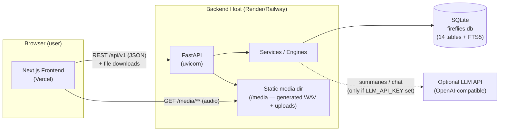
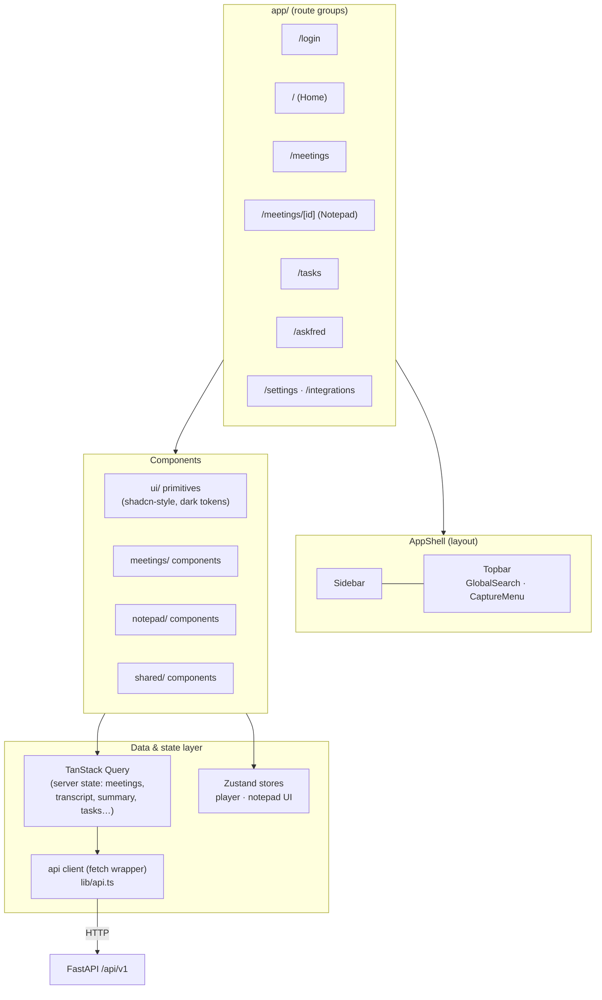
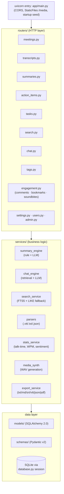

# 02 — High-Level Design (HLD)

> System architecture for the Fireflies clone. Stack is fixed by the assignment: **Next.js (TypeScript) frontend · FastAPI (Python) backend · SQLite database**.

---

## 1. System context



**Key architectural decisions (with rationale)**

1. **Two independent deployables** (`frontend/`, `backend/`) — matches the required repo layout and lets us host the frontend on Vercel and the API on Render.
2. **REST over JSON, versioned under `/api/v1`** — simple, debuggable with curl/Postman, easy to document.
3. **SQLite + WAL mode** — zero-config persistence; more than sufficient for a single-user demo; FTS5 gives real full-text search.
4. **Engines as a service layer** — `summary_engine`, `chat_engine`, `search`, `parsers`, `media_synth` are pure-Python services with **two interchangeable implementations each: rule-based (default, always works offline) and LLM (enabled by env var)**. This is how we "keep mocking minimum" without making the demo depend on an API key.
5. **No real auth** — a seeded default user; the login screen is a faithful UI replica that simply starts the session.
6. **Media strategy** — the seeder synthesizes a real WAV per meeting (soft tones per speaker turn, correct duration), so the player, seek bar, and click-to-seek behave *for real*. Uploaded meetings can attach a real audio/video file. Meetings without media fall back to a virtual clock player.

## 2. Frontend architecture (Next.js App Router)



**Layer responsibilities**

| Layer | Responsibility |
|---|---|
| `app/` routes | Routing, page composition, metadata; pages are thin |
| `components/**` | Presentational + interactive components; no direct fetches |
| `hooks/` | `useAudioPlayer`, `useTranscriptSync`, `useFindInTranscript`, `useDebounce`, `useToast` |
| `store/` | Zustand: `playerStore` (currentTime, playing, speed, activeSegmentId), `notepadStore` (panel sizes, active side panel, edit mode) |
| `lib/api.ts` | Typed fetch wrapper: base URL from `NEXT_PUBLIC_API_URL`, JSON, error normalization, query keys |
| `lib/types.ts` | API response types (mirrors backend Pydantic schemas) |

## 3. Backend architecture (FastAPI)



**Layer responsibilities**

| Layer | Responsibility |
|---|---|
| `routers/` | HTTP semantics only: validate → call service → return Pydantic model / file response |
| `services/` | All business logic; engines are swappable (rule vs LLM); own DB transactions |
| `models/` | SQLAlchemy declarative models = the DB schema (single source of truth; DDL in doc 03) |
| `schemas/` | Pydantic request/response models; API contract |
| `database.py` | Engine, session factory, WAL pragma, `get_db` dependency |
| `seed/` | Idempotent seeder: 8 meetings + synthetic WAVs; runs at startup when DB is empty (or via `POST /api/v1/admin/reseed`) |

## 4. Key data flows

### 4.1 Create meeting from uploaded transcript

```mermaid
sequenceDiagram
    participant UI as Upload Modal
    participant API as POST /api/v1/meetings
    participant P as parsers
    participant SE as summary_engine
    participant MS as media_synth
    participant DB as SQLite

    UI->>API: multipart: title, date, participants, transcript(.vtt/.txt/.json), media?
    API->>P: parse → segments[{speaker, start_ms, end_ms, text}]
    API->>DB: insert meeting(status=processing), participants, segments, FTS
    API-->>UI: 201 {id, status: processing}
    Note over API,DB: BackgroundTask (2–4 s simulated AI processing)
    API->>SE: generate summary + action items (rule or LLM)
    API->>MS: if no media file → synthesize WAV (tones per speaker turn)
    API->>DB: update status=ready, duration, talk-time stats
    Note over UI: React Query invalidates → row appears "ready"; toast "Meeting processed"
```

### 4.2 Interactive transcript ↔ player sync (the core feature)

```mermaid
sequenceDiagram
    participant A as <audio> element
    participant PS as playerStore (Zustand)
    participant TS as useTranscriptSync
    participant TL as TranscriptLine
    participant SS as SmartSearch filters

    A->>PS: timeupdate → currentTimeMs
    PS->>TS: state change
    TS->>TS: binary search over sorted segments: last with start_ms ≤ t
    TS->>TL: activeSegmentId set → purple highlight + scrollIntoView(nearest)
    TL->>SS: filter counts update (questions/tasks/… among *remaining* lines)

    TL->>A: onClick line → audio.currentTime = start_ms/1000
    TL->>A: onSearchMatchClick → seek; <mark> highlights stay
    A->>PS: playbackRate = speed (0.5–2×)
```

### 4.3 AskFred (meeting-scoped & global)

```mermaid
sequenceDiagram
    participant U as User
    participant C as chat UI
    participant API as POST /api/v1/chat (or /meetings/{id}/chat)
    participant CE as chat_engine
    participant LLM as LLM API (optional)

    U->>C: "When was pricing discussed?"
    C->>API: {question}
    API->>CE: resolve scope (one meeting | all)
    alt LLM_API_KEY present
        CE->>LLM: transcript context + citation instruction
        LLM-->>CE: answer text
    else fallback (no key / error)
        CE->>CE: keyword retrieval (TF scoring) over segments
        CE->>CE: extractive answer + intent handlers (action items / takeaways / when-who)
    end
    CE-->>API: {answer, citations:[{meeting, segment, start_ms, quote}]}
    API->>DB: persist chat_messages row
    API-->>C: response; citation chips render → click seeks player
```

## 5. API conventions

- Base URL: `{API_HOST}/api/v1`
- **Envelope**: collections return `{ items: [...], page, page_size, total }`; single resources return the object; errors return FastAPI style `{ detail: "..." }` with proper status codes
- **Methods**: `GET` list/read, `POST` create/act, `PATCH` partial update, `PUT` bulk replace, `DELETE` remove
- **IDs**: integer autoincrement (SQLite-friendly, matches UI keys)
- **Timestamps**: ISO-8601 UTC strings (`meeting_date`, `created_at`); **transcript times are integer milliseconds** (`start_ms`, `end_ms`) — exact, sortable, format-agnostic
- **CORS**: `CORS_ORIGINS` env (localhost:3000 + Vercel domain)
- **Static**: `/media/**` serves generated + uploaded audio/video

## 6. Project (repository) layout

```
fireflies/                      # repo root
├── frontend/                   # Next.js 15 (App Router, TS)
│   ├── src/app/…               # routes (see 03 · §6)
│   ├── src/components/…        # layout / meetings / notepad / tasks / ui / shared
│   ├── src/hooks/…  src/store/…  src/lib/{api.ts,types.ts,utils.ts}
│   ├── public/logo.svg  favicon
│   ├── .env.example            # NEXT_PUBLIC_API_URL
│   └── package.json
├── backend/                    # FastAPI
│   ├── app/
│   │   ├── main.py             # app factory, CORS, static, startup seed
│   │   ├── config.py           # env settings (pydantic-settings)
│   │   ├── database.py         # engine/session/WAL
│   │   ├── models/  schemas/  routers/  services/  seed/
│   │   └── utils/              # time helpers, csv/text utils
│   ├── tests/                  # pytest: API roundtrip, parsers, engines, export
│   ├── data/                   # gitignored: fireflies.db, media/
│   ├── requirements.txt  .env.example
│   └── Dockerfile (optional, for Render)
├── docs/                       # this documentation set
└── README.md                   # setup · architecture · schema · API overview
```

## 7. Deployment plan

| Piece | Target | Notes |
|---|---|---|
| Frontend | **Vercel** | `NEXT_PUBLIC_API_URL` → Render URL; zero-config for Next.js |
| Backend | **Render (Web Service)** | `uvicorn app.main:app`; startup auto-seeds if DB missing; persistent disk mounted at `/data` if available — else re-seeds on boot (documented assumption) |
| Database | SQLite file on the backend host | `data/fireflies.db`; WAL mode; seeded on boot |
| Media | Backend `/media` static dir | Generated WAVs (~2–4 MB each) + uploads |

**Health & ops**: `GET /api/v1/health` (DB reachable, counts, seed status) — used by Render health check and a footer "system status" in Settings.

## 8. Cross-cutting concerns

- **Config**: 12-factor via env vars; `.env.example` in both apps; pydantic-settings on the backend
- **Error handling**: backend raises `HTTPException` with machine-readable `detail`; frontend `api.ts` normalizes to `{ status, message }`; React Query `onError` → toast (never silent failures)
- **Optimistic UI**: action-item toggle, tag add/remove, transcript edits → optimistic update + rollback on failure
- **Performance**: list endpoints paginated (20/page); transcript endpoint streams nothing but is a single payload (≤ ~150 segments/meeting); queries indexed (see schema); `React.memo` on transcript lines (150 rows re-render fast anyway)
- **Accessibility**: focus rings (2px purple), keyboard nav on menus/modals, `aria-*` on tabs/dialogs (Radix primitives give this for free), WCAG-AA contrast on dark tokens

## 9. Why *not* some alternatives (interview-ready rationale)

| Alternative | Why not |
|---|---|
| Django/DRF | Heavier for a pure JSON API; FastAPI's async + Pydantic + auto OpenAPI docs fit better |
| tRPC / GraphQL | Assignment expects a Python backend; REST is the simplest clean contract between two deployables |
| Postgres | Assignment mandates SQLite; FTS5 covers our search needs |
| Next.js API routes as the backend | Assignment mandates a Python backend |
| Storing transcript as one JSON blob | Kills search, per-segment edits, comments/soundbites anchoring, and would look weak in schema evaluation — normalized rows win |
