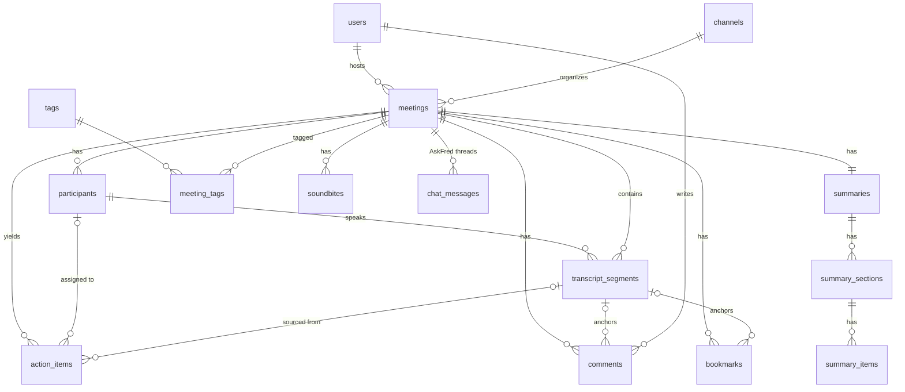

# 03 — Low-Level Design (LLD)

> Database schema, API contract, frontend component tree, and the exact algorithms for the core features (transcript sync, smart search, summary/chat/export engines, seed data).

---

## 1. Database schema (SQLite)

### 1.1 ER diagram



### 1.2 Design rationale (what an evaluator should see)

- **Normalized transcript** — one row per utterance (not a JSON blob) so per-line edit, per-line anchoring (comments, soundbites, action-item provenance), FTS search, and timestamp indexing are all first-class.
- **`*_ms INTEGER` milliseconds** for media times (exact, sortable) vs ISO strings for calendar times.
- **Participants are per-meeting** (name + color + stats denormalized on write, re-computed on transcript change) — matches how the product shows participant chips per meeting and keeps list queries fast.
- **Summaries are structured**: `summaries → summary_sections → summary_items` lets the Notepad render Overview / Action items / Notes / Topics / Metrics blocks in order, with items that can anchor to source segments (click → seek).
- **Action items are top-level** (not summary rows) because they need independent CRUD, status, assignee, due dates, and a Tasks page across meetings — with **provenance** (`source_segment_id`) back to the transcript.
- **FTS5 virtual table + triggers** keep global/transcript search real (SQLite-native full-text search) instead of `LIKE '%…%'` scans.
- **Soft-delete only for meetings** (undo-friendly, matches product's trash semantics); everything else cascades hard.

### 1.3 DDL

```sql
-- ===== users (auth is mocked; exactly one default user is seeded) =====
CREATE TABLE users (
  id            INTEGER PRIMARY KEY AUTOINCREMENT,
  name          TEXT NOT NULL,
  email         TEXT NOT NULL UNIQUE,
  avatar_color  TEXT NOT NULL DEFAULT '#7C5CFF',
  is_default    INTEGER NOT NULL DEFAULT 0,
  created_at    TEXT NOT NULL DEFAULT (strftime('%Y-%m-%dT%H:%M:%fZ','now'))
);

-- ===== channels (Notebook rails: My Meetings is seeded; All Meetings is virtual) =====
CREATE TABLE channels (
  id          INTEGER PRIMARY KEY AUTOINCREMENT,
  name        TEXT NOT NULL UNIQUE,
  description TEXT,
  is_default  INTEGER NOT NULL DEFAULT 0
);

-- ===== meetings =====
CREATE TABLE meetings (
  id               INTEGER PRIMARY KEY AUTOINCREMENT,
  title            TEXT NOT NULL,
  description      TEXT,
  meeting_date     TEXT NOT NULL,             -- ISO-8601 UTC ("2026-10-05T14:30:00Z")
  duration_seconds INTEGER,                   -- NULL while status = scheduled/processing
  host_id          INTEGER NOT NULL REFERENCES users(id),
  channel_id       INTEGER REFERENCES channels(id) ON DELETE SET NULL,
  source           TEXT NOT NULL DEFAULT 'seed',   -- seed | upload | paste | schedule | api
  status           TEXT NOT NULL DEFAULT 'ready',  -- scheduled | processing | ready | failed
  language         TEXT NOT NULL DEFAULT 'en',
  media_path       TEXT,                      -- "media/meeting_12.wav" (served at /media/**)
  media_type       TEXT,                       -- audio | video | NULL
  is_deleted       INTEGER NOT NULL DEFAULT 0,
  created_at       TEXT NOT NULL DEFAULT (strftime('%Y-%m-%dT%H:%M:%fZ','now')),
  updated_at       TEXT NOT NULL DEFAULT (strftime('%Y-%m-%dT%H:%M:%fZ','now'))
);
CREATE INDEX idx_meetings_date ON meetings(meeting_date DESC);
CREATE INDEX idx_meetings_deleted ON meetings(is_deleted, status);

-- ===== participants (per meeting) =====
CREATE TABLE participants (
  id                 INTEGER PRIMARY KEY AUTOINCREMENT,
  meeting_id         INTEGER NOT NULL REFERENCES meetings(id) ON DELETE CASCADE,
  name               TEXT NOT NULL,
  email              TEXT,
  avatar_color       TEXT NOT NULL,           -- from the 10-color speaker palette
  is_host            INTEGER NOT NULL DEFAULT 0,
  talk_time_ms       INTEGER NOT NULL DEFAULT 0,  -- denormalized on write
  word_count         INTEGER NOT NULL DEFAULT 0
);
CREATE INDEX idx_participants_meeting ON participants(meeting_id);

-- ===== transcript_segments (the heart of the app) =====
CREATE TABLE transcript_segments (
  id          INTEGER PRIMARY KEY AUTOINCREMENT,
  meeting_id  INTEGER NOT NULL REFERENCES meetings(id) ON DELETE CASCADE,
  speaker_id  INTEGER REFERENCES participants(id) ON DELETE SET NULL,
  start_ms    INTEGER NOT NULL,
  end_ms      INTEGER NOT NULL,
  text        TEXT NOT NULL,
  confidence  REAL NOT NULL DEFAULT 0.95,
  order_index INTEGER NOT NULL,
  is_edited   INTEGER NOT NULL DEFAULT 0,
  CHECK (end_ms >= start_ms)
);
CREATE INDEX idx_segments_meeting_start ON transcript_segments(meeting_id, start_ms);
CREATE INDEX idx_segments_speaker ON transcript_segments(speaker_id);

-- ===== FTS5 full-text index over segments (kept in sync by triggers) =====
CREATE VIRTUAL TABLE transcript_fts USING fts5(
  text,
  meeting_id UNINDEXED,
  speaker_id UNINDEXED,
  content='transcript_segments', content_rowid='id',
  tokenize='porter unicode61'
);
CREATE TRIGGER segments_ai AFTER INSERT ON transcript_segments BEGIN
  INSERT INTO transcript_fts(rowid, text, meeting_id, speaker_id)
  VALUES (new.id, new.text, new.meeting_id, new.speaker_id);
END;
CREATE TRIGGER segments_ad AFTER DELETE ON transcript_segments BEGIN
  INSERT INTO transcript_fts(transcript_fts, rowid, text, meeting_id, speaker_id)
  VALUES ('delete', old.id, old.text, old.meeting_id, old.speaker_id);
END;
CREATE TRIGGER segments_au AFTER UPDATE OF text ON transcript_segments BEGIN
  INSERT INTO transcript_fts(transcript_fts, rowid, text, meeting_id, speaker_id)
  VALUES ('delete', old.id, old.text, old.meeting_id, old.speaker_id);
  INSERT INTO transcript_fts(rowid, text, meeting_id, speaker_id)
  VALUES (new.id, new.text, new.meeting_id, new.speaker_id);
END;

-- ===== summaries (1:1 with meeting) =====
CREATE TABLE summaries (
  id           INTEGER PRIMARY KEY AUTOINCREMENT,
  meeting_id   INTEGER NOT NULL UNIQUE REFERENCES meetings(id) ON DELETE CASCADE,
  template     TEXT NOT NULL DEFAULT 'general',  -- general | sales | one_on_one | bant
  generated_by TEXT NOT NULL DEFAULT 'seed',    -- seed | rules | llm | manual
  created_at   TEXT NOT NULL DEFAULT (strftime('%Y-%m-%dT%H:%M:%fZ','now')),
  updated_at   TEXT NOT NULL DEFAULT (strftime('%Y-%m-%dT%H:%M:%fZ','now'))
);

CREATE TABLE summary_sections (
  id           INTEGER PRIMARY KEY AUTOINCREMENT,
  summary_id   INTEGER NOT NULL REFERENCES summaries(id) ON DELETE CASCADE,
  section_type TEXT NOT NULL,                  -- overview | action_items | notes | topics | metrics | keywords
  heading      TEXT NOT NULL,                   -- "Overview", "Action items", "Notes", "Topics"
  order_index  INTEGER NOT NULL DEFAULT 0
);
CREATE INDEX idx_sections_summary ON summary_sections(summary_id, order_index);

CREATE TABLE summary_items (
  id                INTEGER PRIMARY KEY AUTOINCREMENT,
  section_id        INTEGER NOT NULL REFERENCES summary_sections(id) ON DELETE CASCADE,
  text              TEXT NOT NULL,
  timestamp_ms      INTEGER,                   -- topics/chapters anchor → click seeks player
  end_timestamp_ms  INTEGER,                   -- chapter ranges ("Use Case  00:00–10:12")
  source_segment_id INTEGER REFERENCES transcript_segments(id) ON DELETE SET NULL, -- provenance → seek
  order_index       INTEGER NOT NULL DEFAULT 0
);

-- ===== action items (independent CRUD + Tasks page + provenance) =====
CREATE TABLE action_items (
  id                INTEGER PRIMARY KEY AUTOINCREMENT,
  meeting_id        INTEGER NOT NULL REFERENCES meetings(id) ON DELETE CASCADE,
  description       TEXT NOT NULL,
  assignee_id       INTEGER REFERENCES participants(id) ON DELETE SET NULL,
  status            TEXT NOT NULL DEFAULT 'open' CHECK (status IN ('open','in_progress','done')),
  due_date          TEXT,
  source_segment_id INTEGER REFERENCES transcript_segments(id) ON DELETE SET NULL,
  completed_at      TEXT,
  order_index       INTEGER NOT NULL DEFAULT 0,
  created_at        TEXT NOT NULL DEFAULT (strftime('%Y-%m-%dT%H:%M:%fZ','now')),
  updated_at        TEXT NOT NULL DEFAULT (strftime('%Y-%m-%dT%H:%M:%fZ','now'))
);
CREATE INDEX idx_actions_meeting ON action_items(meeting_id, status);
CREATE INDEX idx_actions_status ON action_items(status);

-- ===== tags (bonus) =====
CREATE TABLE tags (
  id    INTEGER PRIMARY KEY AUTOINCREMENT,
  name  TEXT NOT NULL UNIQUE COLLATE NOCASE,
  color TEXT NOT NULL DEFAULT '#7C5CFF'
);
CREATE TABLE meeting_tags (
  meeting_id INTEGER NOT NULL REFERENCES meetings(id) ON DELETE CASCADE,
  tag_id     INTEGER NOT NULL REFERENCES tags(id) ON DELETE CASCADE,
  PRIMARY KEY (meeting_id, tag_id)
);

-- ===== comments / bookmarks / soundbites (bonus, anchored to segments) =====
CREATE TABLE comments (
  id         INTEGER PRIMARY KEY AUTOINCREMENT,
  meeting_id INTEGER NOT NULL REFERENCES meetings(id) ON DELETE CASCADE,
  segment_id INTEGER REFERENCES transcript_segments(id) ON DELETE SET NULL,
  user_id    INTEGER REFERENCES users(id) ON DELETE SET NULL,
  body       TEXT NOT NULL,
  created_at TEXT NOT NULL DEFAULT (strftime('%Y-%m-%dT%H:%M:%fZ','now'))
);
CREATE INDEX idx_comments_meeting ON comments(meeting_id);

CREATE TABLE bookmarks (
  id         INTEGER PRIMARY KEY AUTOINCREMENT,
  meeting_id INTEGER NOT NULL REFERENCES meetings(id) ON DELETE CASCADE,
  segment_id INTEGER REFERENCES transcript_segments(id) ON DELETE SET NULL,
  label      TEXT,
  created_at TEXT NOT NULL DEFAULT (strftime('%Y-%m-%dT%H:%M:%fZ','now'))
);

CREATE TABLE soundbites (
  id         INTEGER PRIMARY KEY AUTOINCREMENT,
  meeting_id INTEGER NOT NULL REFERENCES meetings(id) ON DELETE CASCADE,
  title      TEXT NOT NULL,
  start_ms   INTEGER NOT NULL,
  end_ms     INTEGER NOT NULL,
  created_by INTEGER REFERENCES users(id) ON DELETE SET NULL,
  created_at TEXT NOT NULL DEFAULT (strftime('%Y-%m-%dT%H:%M:%fZ','now')),
  CHECK (end_ms > start_ms)
);

-- ===== AskFred chat (meeting-scoped when meeting_id set; global when NULL) =====
CREATE TABLE chat_messages (
  id         INTEGER PRIMARY KEY AUTOINCREMENT,
  meeting_id INTEGER REFERENCES meetings(id) ON DELETE CASCADE,  -- NULL = global AskFred
  role       TEXT NOT NULL CHECK (role IN ('user','assistant')),
  content    TEXT NOT NULL,
  citations  TEXT,                        -- JSON: [{meetingId, meetingTitle, segmentId, startMs, speaker, quote}]
  created_at TEXT NOT NULL DEFAULT (strftime('%Y-%m-%dT%H:%M:%fZ','now'))
);
CREATE INDEX idx_chat_meeting ON chat_messages(meeting_id, id);

-- ===== settings (single row) =====
CREATE TABLE settings (
  id                        INTEGER PRIMARY KEY CHECK (id = 1),
  theme                     TEXT NOT NULL DEFAULT 'dark',
  default_summary_template  TEXT NOT NULL DEFAULT 'general',
  default_playback_speed    REAL NOT NULL DEFAULT 1.0,
  auto_join_meetings        INTEGER NOT NULL DEFAULT 1,
  send_recaps_to            TEXT NOT NULL DEFAULT 'everyone',
  updated_at                TEXT NOT NULL DEFAULT (strftime('%Y-%m-%dT%H:%M:%fZ','now'))
);
```

**Migrations**: Alembic (init + one baseline migration) — evaluated as maturity; fallback `Base.metadata.create_all()` for first boot.

---

## 2. API reference (`/api/v1`)

### 2.1 Meetings

| Method & Path | Purpose |
|---|---|
| `GET /meetings` | Paginated list. Query: `q` (title/description), `participant`, `tag`, `channel`, `source`, `status`, `date_from`, `date_to`, `min_duration`, `sort` (`recent\|date\|duration\|title`), `order` (`asc\|desc`), `page`, `page_size`. Default: `sort=recent` |
| `POST /meetings` | Create. JSON `{title, meeting_date, description?, channel?, participants:[{name,email?}], transcript?: {format:"vtt\|txt\|json\|raw", content: string}}` **or** multipart form with `transcript_file` (.txt/.vtt/.json) + optional `media_file` (mp3/wav/mp4/m4a). Creates → `status=processing` → BackgroundTask generates summary/action items (+ WAV if no media) → `status=ready` |
| `GET /meetings/{id}` | Detail: meeting + participants + summary digest + counts (action items, comments, soundbites) + first-line preview |
| `PATCH /meetings/{id}` | Edit metadata: `title, description, meeting_date, channel_id, language` |
| `DELETE /meetings/{id}` | Hard delete (cascade) — with `?trash=true` → soft delete (`is_deleted=1`), restorable via `POST /meetings/{id}/restore` |
| `GET /meetings/{id}/transcript` | `{meeting_id, duration_ms, segments:[{id, speaker_id, speaker_name, avatar_color, start_ms, end_ms, text, is_edited}]}` |
| `PATCH /transcript-segments/{id}` | Edit one line: `{text}` → autosave; sets `is_edited`, updates FTS + speaker stats |
| `PUT /meetings/{id}/participants` | Replace participant list (merge/rename speakers on segments) |
| `GET /meetings/{id}/stats` | Speaker talk-time (ms + %), words, WPM, sentiment per speaker + questions/fillers counts (computed) |
| `GET /meetings/{id}/export?format=` | `txt\|md\|srt\|vtt\|json\|pdf` → file download (`Content-Disposition`) |
| `POST /meetings/{id}/regenerate` | Re-run summary engine (rule or LLM); body `{template?}` |

### 2.2 Summary & action items

| Method & Path | Purpose |
|---|---|
| `GET /meetings/{id}/summary` | `{template, generated_by, sections:[{id, section_type, heading, items:[{id, text, timestamp_ms?, source_segment_id?}]}]}` |
| `PATCH /summary-items/{id}` | Manual edit of a summary line (edit-mode on summary panel) |
| `POST /summary-items` | Add a manual note under a section |
| `DELETE /summary-items/{id}` | Remove a line |
| `GET /meetings/{id}/action-items` | List w/ assignee + provenance |
| `POST /meetings/{id}/action-items` | `{description, assignee_id?, due_date?, source_segment_id?}` |
| `PATCH /action-items/{id}` | `{description?, assignee_id?, status?, due_date?, order_index?}` — `status→done` stamps `completed_at` |
| `DELETE /action-items/{id}` | Remove |

### 2.3 Tasks, search, chat, engagement, misc

| Method & Path | Purpose |
|---|---|
| `GET /tasks` | Cross-meeting aggregate. Query: `status`, `assignee`, `meeting_id`, `due_before`, `sort` |
| `GET /search?q=&scope=(all\|meetings\|transcripts)&limit=` | `{meetings:[…], transcript_matches:[{meeting_id, meeting_title, segment_id, start_ms, speaker, text(html-snippet with <mark>)}], total}` |
| `GET /meetings/{id}/chat` · `POST /meetings/{id}/chat` | AskFred thread (scoped). POST `{question}` → `{answer, citations}` + persists both messages |
| `GET /chat` · `POST /chat` | Global AskFred across all meetings |
| `GET/POST /meetings/{id}/comments` · `DELETE /comments/{id}` | Timestamped comments (`{segment_id?, body}`) |
| `GET/POST /meetings/{id}/bookmarks` · `DELETE /bookmarks/{id}` | `{segment_id, label?}` |
| `GET/POST /meetings/{id}/soundbites` · `DELETE /soundbites/{id}` | `{title, start_ms, end_ms}` |
| `GET /tags` · `POST /tags` | Tag dictionary |
| `POST /meetings/{id}/tags` · `DELETE /meetings/{id}/tags/{tag_id}` | Tag/untag |
| `GET /me` | Default user (profile menu) |
| `GET /dashboard` | Home stats: `{total_meetings, total_minutes, meetings_this_week, open_tasks, upcoming, top_participants, recent:[…], upcoming_list:[…], ai_feed:[…]}` |
| `GET /settings` · `PUT /settings` | Settings row (persisted) |
| `GET /health` | `{ok, db, meetings, seed, llm_enabled}` |
| `POST /admin/reseed` | Wipe + reseed demo data (Settings → danger zone) |

### 2.4 Representative payloads

`GET /api/v1/meetings?page=1` →

```json
{
  "items": [{
    "id": 2, "title": "Sales Discovery Call — Acme Corp",
    "meeting_date": "2026-10-05T14:30:00Z",
    "duration_seconds": 2040, "status": "ready",
    "source": "seed", "channel": "My Meetings",
    "participants": [{"name":"Sarah Watts","avatar_color":"#FF6FB5"},
                     {"name":"Tom Reyes","avatar_color":"#63E6BE"}],
    "tags": [{"name":"sales","color":"#F783AC"}],
    "action_item_counts": {"open": 3, "done": 1},
    "media_type": "audio"
  }],
  "page": 1, "page_size": 20, "total": 8
}
```

`POST /api/v1/meetings/2/chat` →

```json
// request
{ "question": "When was pricing discussed?" }
// response
{
  "answer": "Pricing came up twice. Tom raised budget concerns at 14:32 ('Our budget is capped at $30k this quarter'), and Sarah walked through the Growth plan pricing at 18:05.",
  "citations": [
    {"meetingId": 2, "meetingTitle": "Sales Discovery Call — Acme Corp",
     "segmentId": 214, "startMs": 872000, "speaker": "Tom Reyes",
     "quote": "Our budget is capped at $30k this quarter…"},
    {"meetingId": 2, "segmentId": 239, "startMs": 1085000, "speaker": "Sarah Watts",
     "quote": "The Growth plan is $19 per user per month…"}
  ]
}
```

---

## 3. Frontend routes & pages

| Route | Page | Key components |
|---|---|---|
| `/login` | Login replica | `LoginHero`, `SocialButton`, `ComplianceChips`, `ProductMockup` |
| `/` | Home | `WelcomeHero`, `QuickStartTiles`, `SegmentedTabs`, `MeetingRow`, `DashboardStats` |
| `/meetings` | Notebook | `ChannelsRail`, `MeetingsToolbar` (tabs+filters+sort), `MeetingRow`, `FiltersDropdown`, `EmptyState` |
| `/meetings/[id]` | **Notepad** | see §4 |
| `/tasks` | Tasks | `TasksSegmented`, `TaskRow`, `NewTaskDialog`, `IntegrationBanner` |
| `/askfred` | Global chat | `ChatRail`, `PromptComposer`, `SuggestionCards`, `ChatBubble` + `CitationChip` |
| `/settings` | Settings | `SettingsTabs`, `DangerZone` |
| `/integrations` | Placeholder | `IntegrationGrid`, `ComingSoonDialog` |

## 4. Notepad component tree (core screen)

```
NotepadPage
├── NotepadHeader            ← back-to-Notebook · title (inline rename) · participants · date · 3-dot menu · ExportMenu
├── SplitLayout (resizable)  ← drag divider; expand L/R; remember in localStorage
│   ├── SummaryPanel (left)
│   │   ├── KeywordChips    ← top keywords; Copy / Reprocess / Edit toolbar; TemplateDropdown
│   │   ├── OverviewSection
│   │   ├── ActionItemsSection  ← checkbox rows · assignee chip · due badge · inline add · edit
│   │   ├── NotesSection     ← bullet notes
│   │   ├── TopicsSection    ← timestamped chapters → click seeks player
│   │   └── MetricsSection
│   └── TranscriptPanel (right)
│       ├── MediaPlayer      ← custom seek bar · play/pause · ±5s · speed · volume · time
│       ├── TranscriptToolbar ← FindInTranscript · EditToggle · AskFredButton
│       └── TranscriptView
│           └── TranscriptLine (memoized)  ← avatar · name chip · mm:ss · text (mark highlights)
├── IconRail (collapsible)   ← SmartSearch · Index · Soundbites · Comments · Bookmarks · AskFred
│   ├── SmartSearchPanel     ← filter chips w/ counts · speaker talk-time bars + WPM
│   ├── IndexPanel           ← jump list
│   ├── SoundbitesPanel      ← clip cards (play clip, share link, delete) + create-from-selection
│   ├── CommentsPanel        ← thread + composer (anchored to segment)
│   ├── BookmarksPanel       ← saved moments
│   └── AskFredPanel         ← suggestions + thread + citations
└── MediaProvider            ← owns <audio>, exposes playerStore
```

### Key hooks & stores

| Unit | Contract |
|---|---|
| `playerStore` (Zustand) | `{ isPlaying, currentTimeMs, durationMs, speed, volume, activeSegmentId, seekTo(ms), setSpeed(x), toggle() }` |
| `useTranscriptSync(segments)` | Subscribes to `currentTimeMs`; **binary search** for active segment; sets `activeSegmentId`; returns `segmentAt(ms)` |
| `useAudioPlayer(meetingId)` | Owns `<audio>` element; wires `timeupdate → playerStore`; exposes seek/skip/speed/volume; fallback **virtual clock** (rAF timer) when `media_path` is null |
| `useFindInTranscript(segments)` | Debounced query → matched segment ids + `<mark>` ranges + count + `next()/prev()`; "filter to matches" toggle |
| `useSmartSearchFilters(segments)` | Classifies each segment (§6.2) → `{questions:[ids], tasks:[], dates:[], metrics:[], pricing:[], sentiment:[], fillers:[]}` with counts |

## 5. Core algorithms

### 5.1 Two-way transcript ↔ player sync

```ts
// useTranscriptSync — O(log n) per timeupdate, n = segments
function findActiveSegment(segments: Segment[], tMs: number): Segment | null {
  let lo = 0, hi = segments.length - 1, ans = null;
  while (lo <= hi) {
    const mid = (lo + hi) >> 1;
    if (segments[mid].start_ms <= tMs) { ans = segments[mid]; lo = mid + 1; }
    else hi = mid - 1;
  }
  return ans && tMs <= ans.end_ms + 800 ? ans : ans; // grace window: line stays active between utterances
}

// timeupdate (4Hz) → store → active segment → highlight + auto-scroll
useEffect(() => {
  if (!activeSegmentId) return;
  document.querySelector(`[data-segment-id="${activeSegmentId}"]`)
    ?.scrollIntoView({ block: "nearest", behavior: "smooth" });
}, [activeSegmentId]);

// click a line (or a summary topic / citation / action-item provenance):
playerStore.seekTo(segment.start_ms);   // → audio.currentTime = start_ms / 1000
```

### 5.2 Smart Search classification (rule-based, mirrors the real product's AI filters)

| Filter | Rule (applied per segment, lowercase) |
|---|---|
| Questions | `/\?\s*$/` or starts with `what|why|how|when|who|where|do|does|did|can|could|should|would|is|are|any` |
| Tasks | contains `will | 'll | shall | going to | need to | needs to | let's | please | can you | could you | make sure | follow up | action item | by (monday…|eod|eow)` |
| Dates | `/\b(mon|tues?|wed(nes)?|thur?s?|fri|sat(ur)?|sun)(day)?\b/i`, `\b\d{1,2}[\/-]\d{1,2}([\/-]\d{2,4})?\b`, month names, `next week|tomorrow|today|eod|end of (day|week|month|quarter)` |
| Metrics | `/\b\d+(\.\d+)?\s*(%|percent|k|m\b|hours?|hrs?|mins?|minutes?|ms\b|users?|dollars?)\b/i` or `/\$\d+/` |
| Pricing | contains `price|pricing|cost|budget|discount|quote|deal size|\$` |
| Sentiment | lexicon score: positive `great|good|excited|love|agree|nice|perfect|happy|excellent|win` / negative `concern|worried|issue|problem|blocker|delay|risk|afraid|unfortunately|disagree|bug|fail` |
| Fillers | `um+|uh+|like,|you know|kind of|sort of|basically|actually` |

Counts per filter render as chips (e.g. `Questions 8 · Tasks 6 · Metrics 3` — exactly like the real Smart Search panel); clicking a chip → jump to first match & highlight all matches.

### 5.3 Rule-based summary engine (default; LLM replaces when key is set)

1. **Sentence split** segments → sentences with `(speaker, start_ms)`.
2. **Keyword scoring**: token freq (stopword-filtered, porter-ish stem) → top-10 meeting keywords (→ `KeywordChips` row).
3. **Overview**: template-assembled 2–3 sentences from top keywords + opening/closing intent lines.
4. **Bullet notes**: top-N scored sentences (diversified — max 1 per speaker per 5-minute window), cleaned of fillers.
5. **Action items**: §5.2 task-rule hits → extract clean task text; assignee = segment speaker when first-person ("I'll send the deck" → Sarah); `source_segment_id` kept for provenance.
6. **Topics/chapters**: sliding window (5 min) keyword-density clustering → chapter title (top 2 keywords) + `[first.start_ms, last.end_ms]` ranges — mirrors real summary ("Use Case & Requirements 00:00–10:12").
7. **Metrics**: §5.2 metric regex hits, deduped, each anchored to its segment.
8. **Templates** alter section composition: `sales` (BANT: budget/authority/need/timeline), `one_on_one` (wins/blockers/goals), `bant` explicit, `general` default.

### 5.4 AskFred retrieval fallback (no LLM key / LLM error)

- **Intents** (regex first, so common questions are crisp): `action items|tasks` → live action-item list; `key takeaways|summary|summarize` → overview+bullets; `when was X discussed` → earliest segment matching X + quote; `who said X` → matching segments grouped by speaker; `how long|duration` → duration + speaker split; `next steps` → open action items.
- **General**: keyword-score all segments (TF + smart boosts), take top-3, compose "Here's what I found:" + timestamped quotes.
- **Citations** always: `[{meeting, segmentId, startMs, speaker, quote}]` → clickable → seeks player (the real product's killer detail).
- **LLM path**: transcript (≤ ~12k tokens) + instruction *"answer concisely, cite timestamps like [mm:ss]"* → post-process `[mm:ss]` refs into citation objects. Any error → fall back to retrieval. Both paths persist `chat_messages`.

### 5.5 Transcript parsers (upload/paste)

| Format | Strategy |
|---|---|
| `.vtt` | `WEBVTT` cue blocks: `00:00:01.000 --> 00:00:04.500` + text; speaker from `Name:` prefix or `<v Name>` |
| `.json` | accept `[{speaker,start,end,text}]` / `{segments:[…]}` / Fireflies-style `{utterances:[…]}`; seconds or ms both |
| `.txt` / raw paste | line regex `^\[?(\d{1,2}:\d{2}(?::\d{2})?)?\]?\s*([A-Z][\w .'-]{0,30}):\s*(.+)$` → speaker+time; lines without timestamp → interpolate; no speakers at all → single "Speaker" |
| timing safety | sort by time, clamp overlaps to 250 ms gaps; duration = last `end_ms` |

### 5.6 Seed WAV synthesis (`media_synth`)

8 kHz mono 16-bit PCM (~16 KB/s → a 30-min meeting ≈ 28 MB is too big; cap seeded audio at **first 3 minutes** rendered as `preview=true`, or full length for meetings ≤ 8 min — file size stays ≤ ~8 MB/meeting). Each speaker = distinct base frequency (220/262/330/392/440 Hz…) with soft amplitude envelope per utterance → **clicking any line audibly "speaks" with a different voice tone**. Silence between segments. Pure stdlib (`wave`, `struct`, `math`) — no ffmpeg dependency.

### 5.7 Export formats

`txt` (speaker \[mm:ss\] lines) · `md` (summary + transcript) · `srt`/`vtt` (proper cue formatting) · `json` (full meeting graph) · `pdf` (reportlab: title page, summary sections, action items table, transcript). All via `GET /meetings/{id}/export` with `Content-Disposition: attachment`.

## 6. Seed data plan (app immediately usable)

Default user **Vishesh Gupta** (matches screenshots) + 8 meetings (all `status=ready`, staggered over the last 3 weeks + 2 upcoming `scheduled`):

| # | Title | Dur | Participants | Tags | Highlights for demo |
|---|---|---|---|---|---|
| 1 | Product Kickoff — Fireflies Clone v2 | 28m | Vishesh, Priya, Arjun, Sneha, Rahul | product, engineering | topics/chapters, 5 action items |
| 2 | Sales Discovery Call — Acme Corp | 34m | Sarah, Tom, Emily | sales, pricing | pricing/metrics hits for Smart Search + AskFred "when was pricing discussed" |
| 3 | Weekly Engineering Sync | 22m | Arjun, Rahul, Diya, Vishesh | engineering | tasks, dates, blockers sentiment |
| 4 | User Research Interview — Onboarding Flow | 19m | Sneha, Maya | research | questions filter (many ?s), soundbite seed |
| 5 | Marketing Sync — Q3 Launch | 26m | Vishesh, Neha, Aditya | marketing, launch | comment thread + bookmarks seed |
| 6 | 1:1 — Vishesh & Priya | 15m | Vishesh, Priya | 1:1 | 1:1 template summary |
| 7 | Sprint Retrospective — Team Phoenix | 31m | Arjun, Priya, Diya, Rahul, Sneha | engineering, retro | done action items, mixed sentiment |
| 8 | Investor Update Call — Northwind Ventures | 24m | Vishesh, Krish, Meera | investors | metrics filter showcase |

Each seeded meeting gets: 60–120 hand-written transcript segments (realistic, multi-speaker, with dates/numbers/questions/fillers deliberately present), full structured summary (5 sections), 3–6 action items (mixed statuses, assignees, due dates, provenance), tags, and generated preview WAV. Meetings 2 & 5 get chat history; 4 & 5 get comments/bookmarks/soundbites.

## 7. Edge cases handled (interview checklist)

| Case | Handling |
|---|---|
| Meeting with no media (`schedule` source) | Virtual clock player — sync + seek still work |
| Segment clicked while audio still loading | Seek queued on `loadedmetadata` |
| Transcript edit while playing | FTS + speaker stats recompute; UI optimistic |
| Search with 0 results | Empty-state component w/ clear-filters CTA |
| Delete meeting open in another tab | React Query error → redirect + toast |
| Concurrent SQLite writes | WAL + short transactions |
| LLM key absent | Rule engines; Settings shows `llm: disabled` |
| Export on Render cold start | Startup seeds before serving (blocking lifespan hook) |
